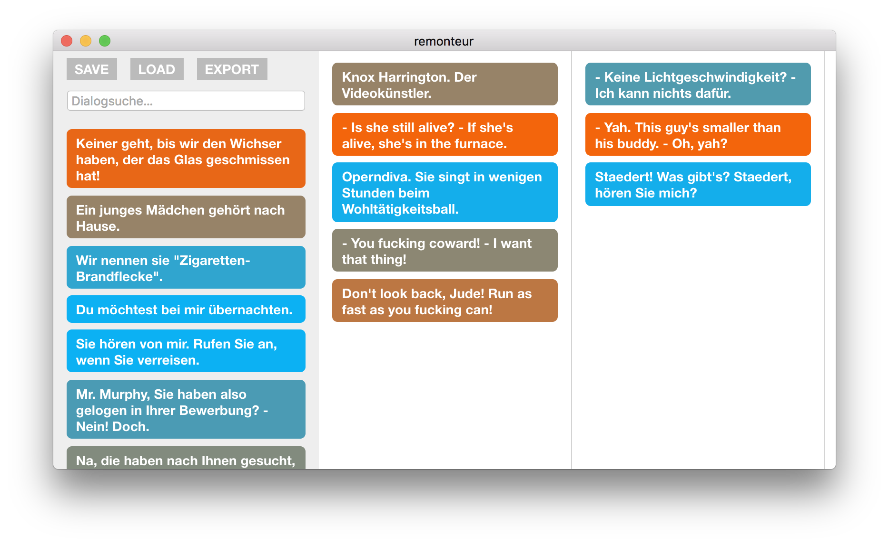

remonteur
=========

*Filmemashups per Sprechtext*

- Volltextsuche in den Dialogen aller Filme der Sammlung
- Anhören per Klick
- Eingefärbt nach Stimm-Höhe (oder was auch immer für die Stimme gehalten wird…)
- Neu-Arrangierung per Drag-n-Drop
- Export als Final-Cut-XML-Projekt für den Feinschnitt

Gui-Benutzung
---------
Ziehe die remonteur-App in den Ordner mit dem ``filme/``-Baum (siehe unten) und doppelklicke, um zu beginnen.

Zum Bearbeiten der exportierten ``fcpxml``-Dateien eignen sich:
 
- Final Cut Pro
- daVinci Resolve

Filmsammlung erstellen
--------------

### Installation

Zum Verarbeiten der Filme werden ein paar Kommandozeilen-Tools benötigt. *Homebrew* kann das schnell und einfach erledigen. [Auf der Website](https://brew.sh) steht alles Notwendige zur Installation. Sobald diese abgeschlossen ist:

1. Installiere *Python* und *ffmpeg* mit
    - ``$ brew install python2 ffmpeg``

2. **Für Liebhaber**: Erstellen einer [virtuellen Umgebung](https://virtualenv.pypa.io/) per
    - ``$ virtualenv -p `which python2` env ``
    - ``$ source env/bin/activate``
    

2. Installiere alle benötigten Python-Module in einem Rutsch mit:
    - ``$ pip2 install -r requirements.txt``

    
### Filme sammeln
Das Tool erwartet ein Verzeichnis, in dem für jeden Film ein Unterordner existiert. Darin befinden sich der Film selbst (.mkv, .mp4 oder .avi) und - falls bereits vorhanden - eine Untertitel-Datei.

- remonteur (GUI, für Verarbeitung nicht benötigt)
- filme/
   - Pocahontas/ 
     - pocahontas.mkv
     - pocahontas.srt
     - *snippets/* (Dialogfetzen, wird vom Tool erzeugt)
   - Der König der Löwen/
     - lionking.avi
     - lionkingDe.srt
     - *snippets/*

   - *lines.db* (Datenbank, wird vom Tool erstellt)

### Filme verarbeiten
``./rescan.py <Filme-Verzeichnis>``

- Setzt automatisch fort, wenn unterbrochen wird
- Lädt fehlende Untertitel herunter

  > **Achtung!** Am besten noch während der Verarbeitung prüfen, ob das Timing der Untertitel stimmt.
  
- ``./check.py <Filme-Verzeichnis>`` zeigt den Zustand der Datenbank an

Entwickeln
==========

(TODO)

Das Gui ist eine electron-Applikation. 

``cd filmton``

``npm install``

``npm run dist``erzeugt app